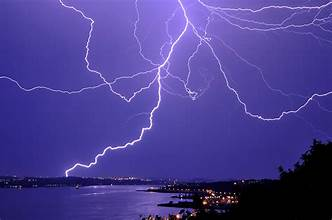

# Weather Condition Classifier

A convolutional neural network that recognizes 11 different weather phenomena—dew, fog/smog, frost, glaze, hail, lightning, rain, rainbow, rime, sandstorm, and snow—from images.

---

## ✨ Highlights

- **Dataset:** 11 labeled folders under `data/dataset/` (too large to include here)  
- **Preprocessing:** Resize to 150×150, normalize pixel values, one-hot encode labels  
- **Augmentation:** Real-time rotations, shifts, zooms, and flips via `ImageDataGenerator`  
- **Model Architecture:** Stacked `Conv2D` + `MaxPooling2D`, followed by `Flatten`, `Dense`, and `Dropout` layers  
- **Hyperparameter Tuning:** Grid search over filter counts, learning rates, and dropout rates  
- **Training Features:** Early stopping, checkpointing, and accuracy/loss visualizations  
- **Inference:** `predict_weather(image_path)` utility for classifying new images  

*Note: The full image dataset (~5 GB) is hosted separately due to its size.*

---

## 🔍 Showcase

| Feature               | Details                                                                                      |
|:----------------------|:---------------------------------------------------------------------------------------------|
| **Classes**           | Dew, Fog/Smog, Frost, Glaze, Hail, Lightning, Rain, Rainbow, Rime, Sandstorm, Snow            |
| **Preprocessing**     | Resize to 150×150, normalize, one-hot encode                                                   |
| **Augmentation**      | Rotation, width/height shift, shear, zoom, horizontal flip                                     |
| **CNN Layers**        | 3× (Conv2D→ReLU→MaxPool), Flatten, Dropout, Dense(ReLU), Dropout, Dense(softmax)              |
| **Tuning**            | Grid search on filters, learning rate, dropout                                                 |
| **Callbacks**         | EarlyStopping (patience=5), ModelCheckpoint (best weights)                                     |

---

## 🚀 Live Demo

|  | .jpeg) |  |
|:---------------------------------:|:--------------------------------------:|:---------------------------------------:|
| **Predicted:** Rainbow            | **Predicted:** Snow                   | **Predicted:** Lightning               |

---

